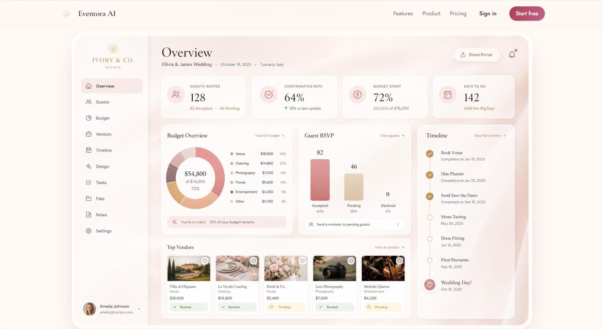
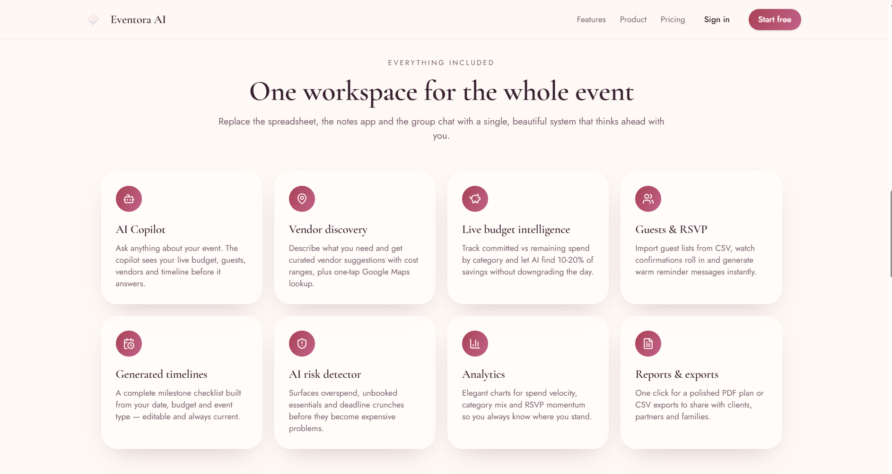

# 📸 Application Screenshots

<table>
<tr>
<td width="50%">

### 🏠 Landing Page

The Landing Page introduces the AI Wedding & Event Planning platform with a modern interface, highlighting its AI-powered planning features, premium services, and intuitive user experience.

</td>
<td width="50%">

### 📊 AI Event Dashboard

The Dashboard enables users to manage weddings and events, monitor budgets, track tasks, organize guests, and oversee every stage of the planning process from a single workspace.

</td>
<td width="50%">

### 🤖 AI Wedding & Event Planner

The AI Assistant helps users generate personalized event plans, recommend venues and vendors, optimize budgets, create schedules, manage guest lists, and provide real-time planning assistance powered by Large Language Models (LLMs).

</td>
</tr>

### 🔐 Login Page

The Login Page provides a secure authentication system, allowing users to sign in and access their personalized event planning dashboard safely.

</td>
</tr>

<tr>
<td width="50%">
</table>
