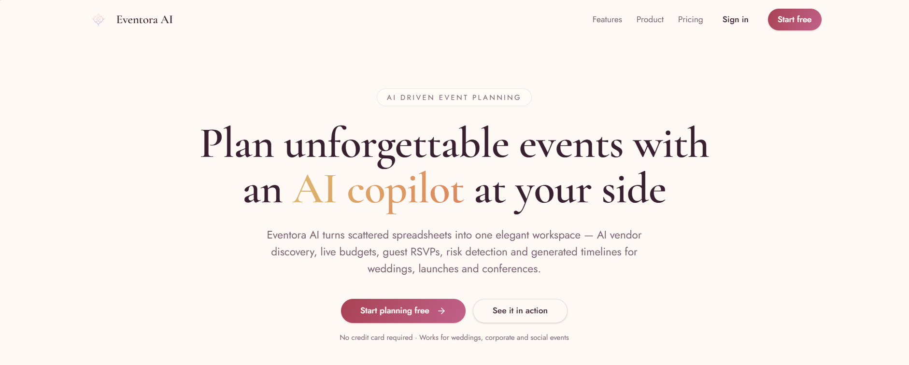

# 💍 Ethereal Planner

### AI Powered Wedding & Event Planning Assistant

<p align="center">
  <strong>Plan smarter. Celebrate better. Make every moment unforgettable.</strong>
</p>

<p align="center">
  An intelligent event planning SaaS that helps you manage vendors, budgets, guests, RSVPs, timelines, and event decisions from one beautiful workspace.
</p>

<p align="center">

[](https://ai-eventora.vercel.app/)
[](https://ai-eventora.vercel.app/dashboard)
[](https://react.dev/)
[](https://ai.google.dev/)

</p>

---

## ✨ Overview

**Ethereal Planner** is a premium AI Powered wedding and event planning platform designed to simplify the entire planning journey.

From discovering vendors and tracking expenses to managing guests and generating personalized timelines, Ethereal Planner brings everything together in a single intelligent dashboard.

The platform combines:

* 🤖 Generative AI
* 📊 Data visualization
* 💰 Budget management
* 🏢 Vendor discovery
* 👥 Guest management
* 📅 Intelligent scheduling
* 📄 Automated reporting

All wrapped in a modern, responsive and elegant SaaS experience.

---

## 🌐 Live Application

### 🚀 Explore Ethereal Planner

**Landing Page**

https://ai-eventora.vercel.app/

**Dashboard**

https://ai-eventora.vercel.app/dashboard

**AI Planner**

https://ai-eventora.vercel.app/planner

---

# 🖥️ Product Preview

## 🏠 Landing Page

The landing page introduces Ethereal Planner with a premium wedding-inspired design, product overview, features, pricing and direct access to the planning dashboard.



---

# 📊 Dashboard

The central command center provides an overview of the entire event.

### Dashboard includes

* Total Budget
* Amount Spent
* Remaining Budget
* Vendor Count
* Guest Count
* RSVP Progress
* Event Countdown
* Upcoming Tasks
* Budget Analytics
* Vendor Status
* Planning Progress


---

# 🤖 AI Planner

Create personalized event plans using AI.

The AI Planner can help generate:

* Event planning strategies
* Wedding checklists
* Vendor suggestions
* Budget recommendations
* Decoration ideas
* Event schedules
* Cost-saving strategies


---

# 🔎 Discover Vendors

Find vendors based on your event requirements and category.

### Supported categories

* 🏛️ Venue
* 🍽️ Catering
* 📸 Photography
* 🎨 Decoration
* 💄 Makeup
* 🎵 DJ & Music
* 🚗 Transportation
* 💌 Invitations
* 🌸 Florists
* 🎥 Videography

Vendor information can include:

* Vendor name
* Location
* Estimated pricing
* Rating
* Reviews summary
* Pros & Cons
* Contact information


---

# 🏢 Vendor Management

Keep all selected vendors organized in one place.

### Vendor features

* Add vendors
* Shortlist vendors
* Mark vendors as selected
* Track vendor status
* Store contact details
* Track estimated cost
* Compare vendors


---

# ⚖️ Vendor Comparison

Compare shortlisted vendors side-by-side to make better planning decisions.

Compare:

| Category    | Details              |
| ----------- | -------------------- |
| 💰 Price    | Estimated pricing    |
| ⭐ Rating    | Vendor rating        |
| 📍 Location | Service location     |
| 📝 Reviews  | AI-generated summary |
| ✅ Pros      | Key advantages       |
| ❌ Cons      | Potential drawbacks  |
| 📞 Contact  | Contact information  |


---

# 💰 Budget Management

Track your event finances in real time.

### Budget features

* Set total event budget
* Add estimated costs
* Add actual expenses
* Calculate total spending
* Calculate remaining budget
* Calculate budget utilization
* Budget warnings
* Category-based breakdown
* Interactive charts


---

# 👥 Guests & RSVP

Manage your complete guest list and track responses.

### RSVP statuses

* 🟡 Pending
* 🟢 Accepted
* 🔴 Declined

### Features

* Add guests manually
* Import guests using CSV
* Track RSVP status
* Generate AI reminder messages
* Copy reminder messages
* View RSVP statistics


---

# 📅 AI Event Timeline

Never miss an important planning milestone.

The timeline automatically organizes tasks based on the event date.

### Example milestones

* Book venue
* Finalize catering
* Hire photographer
* Send invitations
* Confirm vendors
* Finalize guest list
* Make vendor payments
* Final event checklist

### Timeline features

* Event countdown
* AI-generated checklist
* Task completion
* Progress tracking
* Upcoming milestones


---

# 🧠 AI Copilot

Your personal event planning assistant.

Ask questions such as:

> "Recommend affordable photographers."

> "How can I reduce my wedding budget?"

> "Suggest decoration ideas."

> "Create a wedding timeline."

> "Compare my shortlisted vendors."

> "Write an RSVP reminder."

> "Give me cost-saving suggestions."


---

# 📄 Reports

Generate a complete event planning report.

Reports can include:

* 💰 Budget summary
* 🏢 Vendor information
* 👥 Guest list
* RSVP statistics
* 📅 Event timeline
* ✅ Final checklist

Reports can be downloaded as PDF for easy sharing and record keeping.


---

# ⚙️ Settings

Manage application preferences and event data.


---

# 🧩 Application Modules

| Module        | Route        | Description           |
| ------------- | ------------ | --------------------- |
| 🏠 Dashboard  | `/dashboard` | Event overview        |
| 🤖 AI Planner | `/planner`   | AI-powered planning   |
| 🔎 Discover   | `/discover`  | Discover vendors      |
| 🏢 Vendors    | `/vendors`   | Manage vendors        |
| ⚖️ Compare    | `/compare`   | Compare vendors       |
| 💰 Budget     | `/budget`    | Track expenses        |
| 👥 Guests     | `/guests`    | Manage guests & RSVPs |
| 📅 Timeline   | `/timeline`  | Manage event timeline |
| 🧠 AI Copilot | `/assistant` | AI planning assistant |
| 📄 Reports    | `/reports`   | Generate reports      |
| ⚙️ Settings   | `/settings`  | Application settings  |

---

# 🤖 AI Capabilities

Ethereal Planner uses **Google Gemini** to provide intelligent planning assistance.

### AI-powered functionality

* Vendor recommendations
* Vendor comparisons
* Review summarization
* Budget optimization
* RSVP reminder generation
* Event timeline generation
* Checklist generation
* Event planning advice
* Decoration suggestions
* Cost-saving recommendations

---

# 🎨 Design System

Ethereal Planner follows a premium wedding-inspired SaaS design language.

### UI characteristics

* ✨ Luxury aesthetic
* 🪟 Glassmorphism cards
* 🌈 Soft gradients
* 🔤 Elegant typography
* 🔘 Rounded UI components
* 🎞️ Framer Motion animations
* 📱 Fully responsive
* 🌙 Light & Dark mode
* 📊 Interactive charts
* 🎯 Consistent spacing and layout
* ⚡ Fast and smooth interactions

---

# 🛠️ Tech Stack

### Frontend

* React
* TypeScript
* Vite
* Tailwind CSS
* shadcn/ui

### UI & Animation

* Framer Motion
* Lucide React

### Data Visualization

* Recharts

### Forms & Data

* React Hook Form
* TanStack Query
* LocalStorage

### Artificial Intelligence

* Google Gemini API

### Deployment

* Vercel

---

# 📁 Project Structure

```text
ethereal-planner/
│
├── public/
│   └── assets/
│
├── src/
│   ├── components/
│   │   ├── dashboard/
│   │   ├── vendors/
│   │   ├── budget/
│   │   ├── guests/
│   │   ├── timeline/
│   │   └── ui/
│   │
│   ├── pages/
│   │   ├── Dashboard.tsx
│   │   ├── Planner.tsx
│   │   ├── Discover.tsx
│   │   ├── Vendors.tsx
│   │   ├── Compare.tsx
│   │   ├── Budget.tsx
│   │   ├── Guests.tsx
│   │   ├── Timeline.tsx
│   │   ├── Assistant.tsx
│   │   ├── Reports.tsx
│   │   └── Settings.tsx
│   │
│   ├── hooks/
│   ├── lib/
│   ├── services/
│   ├── types/
│   ├── utils/
│   ├── App.tsx
│   └── main.tsx
│
├── assets/
│   ├── landing-page.png
│   ├── dashboard.png
│   ├── ai-planner.png
│   ├── discover-vendors.png
│   ├── vendors.png
│   ├── compare.png
│   ├── budget.png
│   ├── guests-rsvp.png
│   ├── timeline.png
│   ├── ai-copilot.png
│   ├── reports.png
│   └── settings.png
│
├── .env
├── package.json
├── tailwind.config.ts
├── tsconfig.json
└── vite.config.ts
```


# 🔐 Authentication

Ethereal Planner currently uses a **no-login architecture** to provide instant access to the planning workspace.

User data is persisted locally using **LocalStorage**.

---

# 💾 Data Management

The application supports:

* LocalStorage persistence
* JSON export
* JSON import
* CSV guest import
* Local event data management

This allows users to continue planning without creating an account.

---

# 🔮 Future Roadmap

Planned improvements include:

* [ ] Google Calendar integration
* [ ] WhatsApp RSVP integration
* [ ] Email invitations
* [ ] AI seating arrangement
* [ ] AI wedding theme generator
* [ ] AI invitation generator
* [ ] Online vendor booking
* [ ] Payment tracking
* [ ] Multi-event management
* [ ] Cloud synchronization
* [ ] User authentication
* [ ] Collaborative event planning
* [ ] Mobile application
* [ ] Voice-based AI planner

---

# 🌟 Why Ethereal Planner?

Traditional event planning often requires switching between spreadsheets, messaging apps, vendor websites, notes and calendars.

**Ethereal Planner brings everything into one intelligent workspace.**

> **Discover → Compare → Plan → Budget → Manage → Celebrate**

---

# 📸 Complete Product Gallery

| Dashboard                          | AI Planner                           |
| ---------------------------------- | ------------------------------------ |
|  |  |

| Vendor Discovery                         | Vendor Management              |
| ---------------------------------------- | ------------------------------ |
|  |  |

| Vendor Comparison              | Budget                       |
| ------------------------------ | ---------------------------- |
|  |  |

| Guests & RSVP                     | Timeline                         |
| --------------------------------- | -------------------------------- |
|  |  |

| AI Copilot                           | Reports                        |
| ------------------------------------ | ------------------------------ |
|  |  |

| Settings                         |
| -------------------------------- |
|  |

---

 

 

# 📜 License

This project is available under the **MIT License**.

---

<p align="center">

### 💍 Ethereal Planner

**AI Powered planning for extraordinary celebrations.**

 

⭐ Star the repository if you like the project!

</p>
